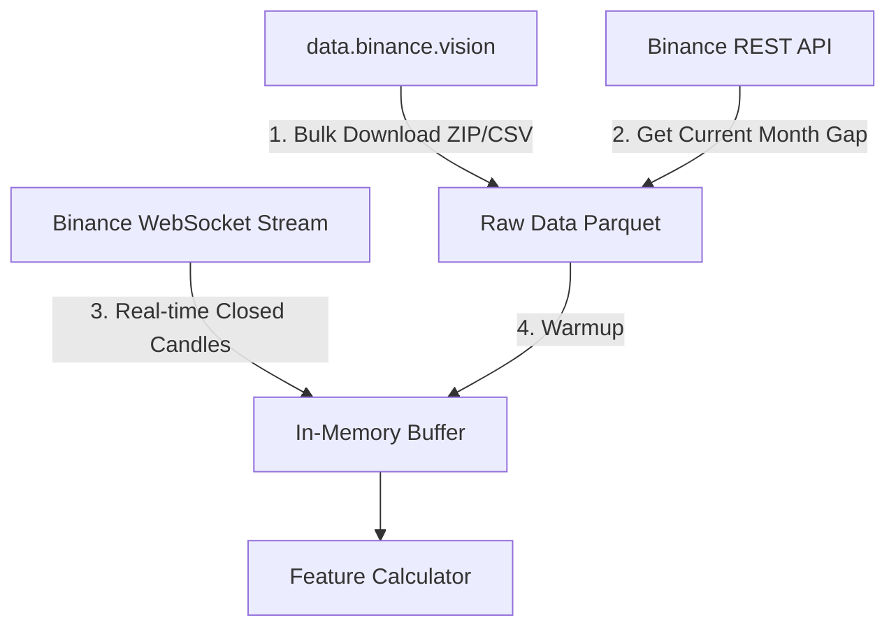

# Arsitektur Logika Prediksi BTC 5-Menit

Dokumen ini menjelaskan alur kerja, sumber data, dan logika penebakan (prediksi) secara *real-time* maupun simulasi pada sistem prediksi BTC 5m.

---

## 1. Alur & Sumber Data (Data Sources)

Sistem menggunakan tiga metode pengumpulan data untuk menyeimbangkan efisiensi, volume data historis, dan kecepatan *real-time*:

1. **Data Historis Lampau (Bulk Download)**: 
   * **Sumber**: `data.binance.vision`.
   * **Penggunaan**: Mengunduh file `.zip` bulanan berisi data kline (candlestick) dari bulan-bulan sebelumnya.
2. **Data Bulan Berjalan (REST API)**:
   * **Sumber**: `api.binance.com` (REST API).
   * **Penggunaan**: Mengisi celah (*gap*) dari tanggal 1 di bulan berjalan hingga detik terakhir sebelum bot dinyalakan.
3. **Data Real-Time (WebSockets)**:
   * **Sumber**: WebSocket public Binance (`wss://stream.binance.com:9443`).
   * **Penggunaan**: Menerima kline secara *real-time* (1m, 5m, 15m, 1h), order book depth, dan data transaksi *aggTrade*.

---

## 2. Cara Kerja Logika Penebakan (Prediction Logic)

Setiap kali lilin (*candle*) timeframe utama **5 menit** ditutup (*closed*), callback `_on_candle_closed` di [live_predict.py](file:///e:/Project/predict-labs/src/live_predict.py) akan dipicu untuk melakukan inferensi:

### A. Rekayasa Fitur (*Feature Engineering*)
Fitur dihitung secara dinamis hanya menggunakan data lilin yang sudah resmi ditutup untuk mencegah terjadinya kebocoran data (*data leakage*):
* Indikator teknikal (RSI, ATR, EMA Fast/Slow, Volume MA).
* Fitur kontekstual dari timeframe yang lebih tinggi (1h).
* Fitur mikro (Order Book Imbalance, AggTrade buy/sell ratio).

### B. Inferensi Model (Machine Learning)
1. Nilai fitur lilin terakhir dimasukkan ke dalam model **LightGBM** yang sudah dilatih sebelumnya.
2. Model mengembalikan nilai probabilitas $\text{P(Naik)}$ antara `0.0` sampai `1.0`.
3. Arah taruhan ditentukan berdasarkan parameter `probability_threshold` (contoh `0.52`):
   $$\text{Arah} = \begin{cases} 
   \text{UP} & \text{jika } \text{P(Naik)} \ge \text{threshold} \\
   \text{DOWN} & \text{jika } \text{P(Naik)} \le (1.0 - \text{threshold}) \\
   \text{NEUTRAL} & \text{selainnya (tidak ada sinyal)}
   \end{cases}$$

---

## 3. Perbedaan Live, Paper, dan Simulasi

Sistem ini mendukung 3 mode eksekusi utama yang dijalankan melalui `--mode` di [main.py](file:///e:/Project/predict-labs/main.py):

| Fitur / Mode | **Simulasi (`--mode simulate`)** | **Paper Trading (`--mode paper`)** | **Live Trading (`--mode live`)** |
| :--- | :--- | :--- | :--- |
| **Koneksi API** | Websocket Public (Tanpa API Key) | Websocket Testnet + API Key Testnet | Websocket Live + API Key Riil |
| **Jenis Dana** | Virtual (Simulasi Lokal) | Virtual (Akun Testnet Binance) | Uang Riil (Akun Live Binance) |
| **Eksekusi Order** | Diuji secara internal di [simulation_engine.py](file:///e:/Project/predict-labs/src/simulation_engine.py) | Dikirim ke API Testnet Binance | Dikirim ke API Live Binance |
| **Logika PnL** | Mengikuti rumus kontrak Binance Predict (harga token dinamis) | Mengikuti aturan Spot/Futures Testnet | Mengikuti aturan Spot/Futures Live |
| **Telegram Log** | Aktif mengirim laporan simulasi | Aktif mengirim laporan transaksi testnet | Aktif mengirim laporan transaksi riil |

### Detail Mekanisme Eksekusi Simulasi
Di dalam **Simulation Mode**, kita menyimulasikan produk **Binance Predict** (Binary Option):
* **Entry**: Ketika terdeteksi sinyal UP/DOWN di akhir lilin $T$, simulasikan pembelian token seharga `entry_cost` (berkisar \$0.01 - \$0.99) yang nilainya proporsional terhadap probabilitas keyakinan model.
* **Exit**: Pada lilin berikutnya $T+1$ ditutup (5 menit kemudian), jika arah tebakan benar, token berharga **\$1.00** (Profit = `$1.00 - entry\_cost - fee`). Jika salah, token berharga **\$0.00** (Rugi = `-entry_cost - fee`).
